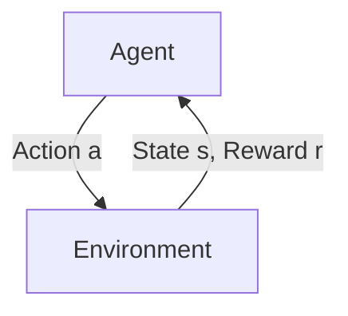

<p align="center">
  
</p>

<h1 align="center">🧠 CS234: Reinforcement Learning — Revisited</h1>
<p align="center">
  <i>Learning deeply. Rewriting clearly. Sharing openly.</i>
</p>

<p align="center">
  <a href="#"></a>
  <a href="#"></a>
  <a href="#"></a>
  <a href="#"></a>
  <a href="#"></a>
</p>

---

> 🎯 **Project Goal**  
> Revisit, re-implement, and deeply understand key RL concepts from Stanford CS234/XCS234. This is a personal study + teaching repository designed to:
> - ✍️ Reinforce my own understanding of RL foundations  
> - 📚 Share readable summaries and assignments for other learners  
> - 🧱 Serve as a reference base for future RL-related projects  

---

## 📂 What's Inside

| Folder        | Description |
|---------------|-------------|
| [`lectures/`](./lectures)   | Rewritten lecture notes with diagrams and core formulas |
| [`assignments/`](./assignments) | Key CS234 homework revisited, clarified, and modularized |
| [`summaries/`](./summaries) | My personal takeaways, analogies, and simplified concepts |
| [`references/`](./references) | Curated readings, papers, tools, and extra materials |
| [`utils/`](./utils)         | Shared plotting or training tools (optional) |

---

## 🧠 RL Architecture (Simplified View)



- 🔁 Agent selects actions based on policy π  
- 🎯 Environment provides new state and reward  
- 🧮 Agent updates value functions / policy using learning algorithm

---

## 📝 Sample Summary: Q-Learning

> 🔍 **Off-policy learning** method using value function `Q(s, a)`

```python
# Tabular Q-Learning update rule
Q[s, a] += alpha * (r + gamma * max_a_prime(Q[s_next, a_prime]) - Q[s, a])
```

$$
Q_{t+1}(s,a) \;=\;
Q_{t}(s,a) + \alpha
\Bigl[r + \gamma \max_{a'} Q_{t}(s',a') - Q_{t}(s,a)\Bigr]
$$

- Learns optimal action-value function via experience
- Basis of DQN and other deep RL methods

---

## 📚 Reference Stack

| Category | Links |
|----------|-------|
| 🎓 CS234 | [CS234 Website](https://web.stanford.edu/class/cs234/) |
| 🛠️ Toolkits | [CleanRL](https://github.com/vwxyzjn/cleanrl), [Gymnasium](https://gym.openai.com/) |
| 📘 Concepts | [David Silver's RL Course](https://www.davidsilver.uk/teaching/) |
| 📙 Spinning Up | [OpenAI Spinning Up](https://spinningup.openai.com/en/latest/) |
| 🎮 Visualization | [RL Playground](http://rl-playground.com/) |

---

## 🖥️ Working Environment

| Purpose | Hardware | OS / Drivers | Python | Deep-Learning Stack |
|---------|----------|--------------|--------|---------------------|
| **Dev / CPU experiments** | MacBook Pro (M3 Pro) | macOS 15.5 | 3.12 | PyTorch 2.7 • CPU |
| **Prod / GPU training** | AMD Ryzen 9 9950X & NVIDIA RTX 5090 | Ubuntu 24.04 & NVIDIA Open Driver 570 & CUDA 12.9 | 3.12 | PyTorch 2.7 • CUDA |

> *I prototype on macOS, then run large-scale GPU workloads on the Ubuntu 24.04 workstation.*

---

## ⚖️ License

- 🧪 Code and implementation: [MIT License](./LICENSE)
- 📘 Notes, summaries, and markdown content: [CC BY-NC 4.0](./LICENSE_CONTENT.md)

> Feel free to reuse/adapt with attribution — for **non-commercial use only**.

---


## 🤝 Acknowledgements

Thanks to:
- CS234 staff for high-quality lectures and assignments
- Stanford Continuing Studies & XCS234
- Open source contributors (CleanRL, SpinningUp, etc.)

---

<p align="center">
  
</p>