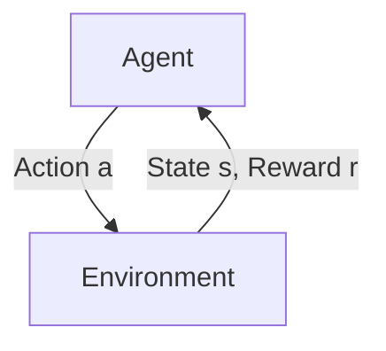

<p align="center">
  
</p>

<h1 align="center">🧠 CS234: Reinforcement Learning — Revisited</h1>
<p align="center">
  <i>Learning deeply. Rewriting clearly. Sharing openly.</i>
</p>

<p align="center">
  <a href="#"></a>
  <a href="#"></a>
  <a href="#"></a>
  <a href="#"></a>
  <a href="#"></a>
</p>

---

> 🎯 **Project Goal**  
> Revisit, re-implement, and deeply understand key RL concepts from Stanford CS234/XCS234. This is a personal study + teaching repository designed to:
> - ✍️ Reinforce my own understanding of RL foundations  
> - 📚 Share readable summaries and assignments for other learners  
> - 🧱 Serve as a reference base for future RL-related projects  

---

## 📂 What's Inside

| Folder        | Description |
|---------------|-------------|
| [`lectures/`](./lectures)   | Rewritten lecture notes with diagrams and core formulas |
| [`assignments/`](./assignments) | Key CS234 homework revisited, clarified, and modularized |
| [`summaries/`](./summaries) | My personal takeaways, analogies, and simplified concepts |
| [`references/`](./references) | Curated readings, papers, tools, and extra materials |
| [`utils/`](./utils)         | Shared plotting or training tools (optional) |

### Comparison with CS224R

CS224R (Deep Reinforcement Learning) and XCS234 (Reinforcement Learning) offer complementary perspectives on RL education. For a detailed analysis, see [cs224r-vs-cs234.md](cs224r-vs-cs234.md).

**Key Differences:**

| Aspect | XCS234 | CS224R |
|--------|---------|---------|
| **Approach** | Theory-first with mathematical rigor | Research implementation-focused |
| **Coverage** | Broad foundations + bandits + human alignment | Cutting-edge robotics + offline RL + meta-learning |
| **Environments** | Multi-domain (games, healthcare, recommendations) | Primarily advanced robotics (MuJoCo, manipulation) |
| **Learning Path** | MDPs → Value methods → Policy methods → Modern topics | Imitation → Model-based → Offline → Meta-learning |

**Perfect Complementarity:**
- **XCS234** builds theoretical foundations and covers classical RL progression
- **CS224R** applies cutting-edge methods to complex real-world robotics problems
- Together they provide comprehensive RL education from theory to research frontiers

**Recommendation:** Take XCS234 first for mathematical foundations, then CS224R for advanced implementation skills.

### 📑 Homework Summaries

- [CS234 Homework Summaries](summaries/cs234hws.md): Clear, concise explanations and solutions for key CS234 assignments, rewritten for better understanding and modularity.
- [CS224R Homework Summaries](summaries/cs224r_hws.md): Summaries and annotated solutions for CS224R assignments, focusing on deep RL and advanced topics.


---

## 🖥️ Typical Work Environments

| Environment         | Where you type `tmux`                | Typical Usage & Actions                                      |
|---------------------|--------------------------------------|--------------------------------------------------------------|
| **MacBook Pro (local)** | *Not needed*                         | Use VS Code's integrated terminal for quick prototyping.     |
| **Workstation (Ubuntu 24.04, RTX 5090)** | **Yes** — open terminal in VS Code Remote-SSH, run `tmux new -s dev` | Keeps long-running jobs alive if VS Code disconnects.        |
| **AWS EC2 GPU VM (Ubuntu 22.04 or 24.04)** | **Yes** — SSH in, then `tmux new -s train`                   | Essential for spot instances; training survives network drops.|

### 🗝️ Key Guide: Remote VM Setup, Git, and VS Code

For a step-by-step guide to setting up a remote development environment (including VM provisioning, SSH, Git, and VS Code Remote-SSH), see:

- [Remote VM Setup, Git, and VS Code](remote_vm_setup_and_git_and_vscode.md)


This guide covers:
- Creating and configuring a cloud VM (e.g., AWS EC2)
- Setting up SSH keys and secure access
- Installing essential packages (Python, CUDA, etc.)
- Cloning this repository via Git
- Using VS Code Remote-SSH for seamless development

*Recommended for anyone running code or training on remote servers!*

## 🧠 RL Architecture (Simplified View)



- 🔁 Agent selects actions based on policy π  
- 🎯 Environment provides new state and reward  
- 🧮 Agent updates value functions / policy using learning algorithm

---
## ⚖️ License & Attributions

For license details and attributions, see [LICENSING.md](./LICENSING.md):

- **Code** (MIT License)
- **Content** (CC BY-NC 4.0, excluding official Stanford course materials)
- **Stanford Course Materials** (© Stanford University, under Stanford's license terms)

---

## 📝 Sample Summary: Q-Learning

> 🔍 **Off-policy learning** method using value function `Q(s, a)`

```python
# Tabular Q-Learning update rule
Q[s, a] += alpha * (r + gamma * max_a_prime(Q[s_next, a_prime]) - Q[s, a])
```

$$
Q_{t+1}(s,a) \;=\;
Q_{t}(s,a) + \alpha
\Bigl[r + \gamma \max_{a'} Q_{t}(s',a') - Q_{t}(s,a)\Bigr]
$$

- Learns optimal action-value function via experience
- Basis of DQN and other deep RL methods

---

## 📚 Reference Stack

| Category | Links |
|----------|-------|
| 🎓 CS234 | [CS234 Website](https://web.stanford.edu/class/cs234/) |

---

## 🖥️ Working Environment

| Purpose | Hardware | OS / Drivers | Python | DL Stack |
|---------|----------|--------------|--------|----------|
| **Dev / CPU** | MacBook Pro (M3 Pro) | macOS 15.5 | 3.12 | PyTorch 2.7 • CPU |
| **Prod / GPU** | Ryzen 9 9950X + RTX 5090 | Ubuntu 24.04 · Driver 570 · CUDA 12.8+ | 3.12 | PyTorch 2.7 • CUDA |
| **Cloud / Burst** | AWS EC2 (Tesla V100) | Ubuntu 22.04 · CUDA 12.x | 3.12 | PyTorch 2.7 • CUDA |
*Prototype locally → train on 5090 workstation → scale up on EC2 as needed.*

> *I prototype on macOS, run large-scale GPU workloads on the Ubuntu 24.04 workstation (RTX 5090), and use AWS EC2 for additional compute when required.*

---


## 🤝 Acknowledgements

Thanks to:
- CS234 staff for high-quality lectures and assignments
- Stanford Continuing Studies & XCS234
- Open source contributors (CleanRL, SpinningUp, etc.)
- Thanks to Prof. Emma Brunskill and the CS234 team for their foundational work in RL education
  
---

<p align="center">
  
</p>