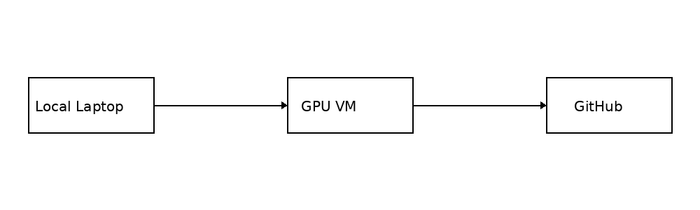

# 🚀 Remote VM Setup & VS Code Workflow (CS234 Edition)

<p align="center">
  
</p>

*Updated June 08, 2025*

> **Why this guide?**  
> Many CS234 assignments need more GPU power than a laptop can offer.  
> This guide shows **exactly** how to spin‑up a cloud VM, sync code with Git, and develop through **VS Code Remote‑SSH**—with keyboard shortcuts for **macOS** and **Windows/Linux**.

---

## 🗺️ End‑to‑End Workflow

<p align="center">
  
</p>

1. **Local Laptop** → write & test small code   
2. **Git push / Remote‑SSH** → **GPU VM** (AWS EC2, Azure, GCP…)   
3. **VS Code** on your laptop opens a remote window, so training runs on the VM but editing feels local.   
4. **GitHub** remains the single source of truth.

---

## 1  Launch & Secure the VM

| Step | Command / UI | Notes |
|------|--------------|-------|
| **Create EC2** | Use the Ubuntu 24.04 5090 GPU or AWS | Cheaper spot pricing if available |
| **Security group** | Allow **SSH (port 22)** from **your IP only** | Reduce attack surface |
| **Login (SSH key)** | `ssh -i ~/.ssh/cs234.pem ubuntu@<IP>` | No password prompts|
| **Login (password)** | `ssh user@<IP>` → enter password | Not recommended  |

---

## 2  Synchronise Code with Git

```bash
# ON THE VM
git config --global user.name  "Your Name"
git config --global user.email "you@example.com"

# clone via SSH
git clone git@github.com:<user>/<repo>.git     # fastest round‑trip

# OR clone via HTTPS and cache credential 1 h
git config --global credential.helper 'cache --timeout=3600'
git clone https://github.com/<user>/<repo>.git
```

SSH key workflow: generate → copy pubkey → GitHub Settings → test `ssh -T git@github.com`

---

## 3  VS Code Remote‑SSH (macOS & Windows keys)

| Action | macOS | Windows / Linux |
|--------|-------|-----------------|
| **Open remote window** | <kbd>⌘⇧P</kbd> → `Remote‑SSH: Connect…` | <kbd>Ctrl ⇧ P</kbd> |
| **Integrated terminal** | <kbd>⌃`</kbd> (Control +\`) | <kbd>Ctrl `</kbd> |
| **Split terminal** | <kbd>⌘ ⌥ 5</kbd> | <kbd>Ctrl Shift 5</kbd> |

> After connecting, **open the folder** containing your assignment and create a Python env (e.g. `conda env create -f environment.yml`). Steps 1–7 in the original doc are unchanged.

---

## 4  Process Management with TMUX

### 🖇️ Which machine runs TMUX ?

| Scenario | Where you type `tmux` | Typical actions |
|----------|----------------------|-----------------|
| **Local laptop (MacBook)** | *Not needed*  | Use the built-in VS Code terminal for quick tests. |
| **Home workstation (RTX 5090 @ Ubuntu 24.04)** | **Yes** — open a terminal tab in VS Code Remote-SSH and run `tmux new -s dev` | Keeps long jobs alive if VS Code disconnects. |
| **AWS EC2 GPU VM** | **Yes** — SSH first, then `tmux new -s train` | Critical for spot instances; lets training survive network drops. |

> **Rule of thumb:** start TMUX on _any_ host that will run training longer than a few minutes.
> You can happily nest: VS Code → SSH → TMUX session.


### 🛠️ Quick install checklist (per machine)

| Machine | Must-have tools | Optional / GPU-specific |
|---------|-----------------|-------------------------|
| **MacBook (M3 Pro)** | Homebrew, Git, VS Code, Remote-SSH extension, Python 3.12, Conda/Miniconda | — |
| **Workstation (5090 + Ryzen 9950X)** | Ubuntu 24.04, `build-essential`, Git, Conda, Python 3.12, **TMUX**, VS Code Server | NVIDIA Driver 570, CUDA 12.9, cuDNN |
| **AWS EC2 (V100)** | Ubuntu 22.04, Git, Conda, Python 3.12, **TMUX**, VS Code Server | Latest AWS GPU driver (`nvidia-driver-latest`), CUDA 12.x |

> *Tip*: run `sudo apt install tmux htop` immediately after provisioning any Ubuntu host.

---

**Cheatsheet (works on macOS & Windows terminals):**

| Key | Action |
|-----|--------|
| `tmux new -s name` | new session |
| `Ctrl‑b d` | detach |
| `tmux a -t name` | attach |
| `Ctrl‑b "` | split horizontal |
| `Ctrl‑b %` | split vertical |
| `Ctrl‑b arrow` | move pane |
| `tmux kill‑session -t name` | kill session |


---

## 5  Monitoring RAM & GPU

| Command | What it shows |
|---------|---------------|
| `watch -n1 nvidia-smi` | GPU memory / utilization (refresh 1 s) |
| `htop` | CPU cores, RAM, load avg  |
| `ps -fA | grep python` | running Python PIDs |

Low‑memory fixes: lower batch size, trim model, gradient accumulation, multi‑GPU (costly)  

---

## 6  Shut Down & Save 💸

Stop or terminate EC2 when done to avoid charges 
Tip: create an **Instance Scheduler** tag or use AWS Lambda auto‑stop scripts for idle VMs.

---

## 7  One‑Minute Quick Start

```bash
# local -> push code
git add .
git commit -m "feat: finish hw2"
git push origin main

# connect & run remotely
ssh -i ~/.ssh/cs234.pem ubuntu@<IP>
cd cs234-hw
tmux new -s train
python train.py --config configs/hw2.yaml
Ctrl‑b d  # detach
```

---

### Troubleshooting Table

| Symptom | Fix |
|---------|-----|
| VS Code cannot connect | Check `~/.ssh/config`; add `ServerAliveInterval 60` |
| GPU not visible | Install correct NVIDIA driver & `nvidia-smi`; reboot |
| Conda env missing | `conda create -n cs234 python=3.12 pytorch==2.7 cudatoolkit=12.1 -c pytorch -c conda-forge` |

---