# Reinforcement Learning: Complete Learning Summary

*A comprehensive visual guide to reinforcement learning concepts learned through CS224R and XCS234*

## 🎯 The RL Framework Overview


## 📚 Course Learning Progression

### XCS234: Foundation Building Journey


### CS224R: Advanced Implementation Journey


## 🧠 Core Algorithm Categories

### Value-Based Methods


### Policy-Based Methods


## 🎮 Environment Complexity Progression

### XCS234 Environment Journey


### CS224R Environment Journey


## 🔄 Algorithm Performance Comparison

### Sample Efficiency Spectrum


## 🏗️ Implementation Architecture

### Typical RL Agent Architecture


## 🎯 Key Learning Outcomes by Topic

### 1. Exploration vs Exploitation


### 2. Function Approximation Methods


### 3. Reward Engineering Spectrum


## 🔬 Advanced Topics Mastered

### Offline RL Methods Comparison


### Meta-Learning Paradigms

```mermaid
graph LR
    A[Meta-RL Approaches] --> B[End-to-End<br/>RL²]
    A --> C[Factorized<br/>DREAM]
    A --> D[Goal-Conditioned<br/>HER]
    
    B --> B1[Single network<br/>learns everything]
    C --> C1[Separate exploration<br/>& exploitation]
    D --> D1[Hindsight relabeling<br/>sparse rewards]
    
    B1 --> B2[Simple but limited]
    C1 --> C2[More interpretable]
    D1 --> D2[Highly effective]
    
    style B2 fill:#ffcdd2
    style C2 fill:#fff9c4
    style D2 fill:#c8e6c9
```


## 📊 Performance Insights

### Algorithm Suitability Matrix
| Environment Type | Sample Efficiency | Stability | Implementation |
|------------------|-------------------|-----------|----------------|
| **Discrete, Small** | Q-Learning ⭐⭐⭐ | Tabular ⭐⭐⭐ | Simple ⭐⭐⭐ |
| **Continuous Control** | PPO ⭐⭐ | SAC ⭐⭐⭐ | Actor-Critic ⭐⭐ |
| **Sparse Rewards** | HER ⭐⭐⭐ | Goal-Conditioned ⭐⭐ | Complex ⭐ |
| **Offline Data** | IQL/CQL ⭐⭐⭐ | Conservative ⭐⭐⭐ | Medium ⭐⭐ |
| **Fast Adaptation** | Meta-RL ⭐⭐⭐ | Context-dependent ⭐⭐ | Very Complex ⭐ |

## 🛠️ Practical Implementation Lessons

### Common Pitfalls and Solutions


### Debugging Workflow

```mermaid
flowchart TD
    A[RL Training Issues] --> B{Learning Curve?}
    B -->|Flat| C[Check reward signal]
    B -->|Unstable| D[Reduce learning rate]
    B -->|Slow| E[Increase exploration]
    
    C --> C1[Verify reward function<br/>Check environment setup]
    D --> D1[Add target networks<br/>Use gradient clipping]
    E --> E1[Tune ε in ε-greedy<br/>Add curiosity bonuses]
    
    C1 --> F[Monitor key metrics]
    D1 --> F
    E1 --> F
    
    F --> F1[✓ Episode returns<br/>✓ Q-value estimates<br/>✓ Policy entropy<br/>✓ Loss curves]
```


## 🎯 CS224R Homework Significance and Interconnections

### Why These Assignments Matter in RL Research

The CS224R homework sequence represents a carefully designed journey through the most critical challenges in modern reinforcement learning, each building upon previous concepts while introducing new paradigms that define the current research frontier.

### Assignment Progression and Dependencies


### The Fundamental RL Challenges Addressed

#### 1. The Cold Start Problem (HW1)


**Significance**: Imitation learning solves the fundamental problem of how to start learning efficiently. Without expert demonstrations, RL agents often require millions of random interactions to discover even basic behaviors.

#### 2. The Reward Engineering Dilemma (HW2)


**Significance**: This homework addresses one of RL's most practical challenges - how to specify what you want the agent to achieve. Poor reward design leads to spectacular failures in real systems.

#### 3. The Data Efficiency Crisis (HW3)


**Significance**: Offline RL is crucial for real-world deployment where online exploration is expensive, dangerous, or impossible. This represents the future of practical RL applications.

#### 4. The Generalization Challenge (HW4)
```mermaid
graph TD
    A[Single Task RL] --> A1[Task-specific solutions<br/>No transfer capability]
    
    B[Goal-Conditioned RL] --> B1[HER Algorithm]
    B1 --> B2[Sparse reward handling<br/>Goal relabeling]
    
    C[Meta-Learning] --> C1[RL² End-to-End]
    C --> C2[DREAM Factorized]
    
    C1 --> D[Fast Adaptation]
    C2 --> D
    B2 --> E[Efficient Goal Achievement]
    
    D --> F[Few-shot learning<br/>Rapid task transfer]
    E --> F
    
    style A1 fill:#ffcdd2
    style F fill:#c8e6c9
```

**Significance**: Meta-learning and goal-conditioning represent the path toward general AI systems that can quickly adapt to new tasks, rather than requiring complete retraining.

### Interconnected Learning Architecture

#### How Each Assignment Builds on Previous Ones
```mermaid
graph TD
    subgraph "Knowledge Transfer Flow"
        A[HW1: Policy Learning] --> B[HW2: Policy + Rewards]
        B --> C[HW3: Policy from Fixed Data]
        C --> D[HW4: Multi-task Policies]
    end
    
    subgraph "Technical Skills Progression"
        E[Neural Network Policies] --> F[Critic Networks]
        F --> G[Conservative Learning]
        G --> H[Meta-Learning Architectures]
    end
    
    subgraph "Problem Complexity Increase"
        I[Single Task, Expert Data] --> J[Single Task, Reward Design]
        J --> K[Single Task, No Exploration]
        K --> L[Multiple Tasks, Fast Adaptation]
    end
    
    A -.-> E
    B -.-> F
    C -.-> G
    D -.-> H
    
    E -.-> I
    F -.-> J
    G -.-> K
    H -.-> L
```

### Relationship to Broader RL Research Landscape

#### Positioning in RL Evolution Timeline
```mermaid
timeline
    title RL Research Evolution and CS224R Coverage
    
    section Classical RL
        Tabular Methods     : Q-Learning
                           : Policy Iteration
                           
    section Deep RL Era
        Function Approximation : DQN
                              : Policy Gradients
                              : [Covered in XCS234]
                              
    section Modern Challenges
        Sample Efficiency    : Imitation Learning (HW1)
                            : Model-Based Control (HW2)
                            
    section Current Frontier
        Practical Deployment : Offline RL (HW3)
                            : Meta-Learning (HW4)
                            : [CS224R Focus Area]
                            
    section Future Directions
        Foundation Models   : Large-scale pretraining
                           : Multi-modal RL
```

#### Why This Specific Sequence Matters

**1. Pedagogical Progression**
- **HW1**: Establishes neural policy learning fundamentals
- **HW2**: Introduces multi-objective optimization and model-based thinking
- **HW3**: Addresses real-world deployment constraints
- **HW4**: Pushes toward general intelligence capabilities

**2. Research Relevance**
```mermaid
pie title Current RL Research Distribution
    "Imitation Learning" : 15
    "Reward Engineering" : 10
    "Offline RL" : 35
    "Meta-Learning" : 25
    "Other Advanced Topics" : 15
```

**3. Industry Applications**
- **Robotics**: All four homeworks directly applicable to robot learning
- **Autonomous Systems**: Offline RL for safety-critical applications
- **Game AI**: Meta-learning for multi-game agents
- **Recommendation Systems**: Goal-conditioned RL for personalization

### Critical Insights from the Assignment Sequence

#### The Hierarchy of RL Challenges
```mermaid
graph TD
    A[Level 1: Learning to Act] --> B[Level 2: Learning Objectives]
    B --> C[Level 3: Learning from Data]
    C --> D[Level 4: Learning to Learn]
    
    A1[HW1: Imitation Learning<br/>Copy expert behavior] --> A
    B1[HW2: Reward Engineering<br/>Define what success means] --> B
    C1[HW3: Offline RL<br/>Learn without exploration] --> C
    D1[HW4: Meta-Learning<br/>Adapt quickly to new tasks] --> D
    
    style A1 fill:#e8f5e8
    style B1 fill:#fff3e0
    style C1 fill:#e1f5fe
    style D1 fill:#f3e5f5
```

#### Why Each Homework is Essential for Modern RL Practitioners

| Homework | Core Problem | Why Critical | Industry Impact |
|----------|--------------|--------------|-----------------|
| **HW1** | **Bootstrap Problem** | RL agents need starting points | **95%** of real robots use imitation learning |
| **HW2** | **Objective Specification** | Poorly designed rewards cause failures | **$Millions** lost to reward hacking in production |
| **HW3** | **Sample Efficiency** | Online exploration often impossible | **Future** of RL deployment in safety-critical domains |
| **HW4** | **Generalization** | Single-task RL doesn't scale | **Path** to artificial general intelligence |

#### The Research Impact Chain
```mermaid
graph LR
    A[CS224R Assignments] --> B[Research Skills]
    B --> C[Novel Algorithms]
    C --> D[Real-world Impact]
    
    A --> A1[Implementation Mastery]
    A --> A2[Problem Understanding]
    A --> A3[Debugging Skills]
    
    B --> B1[Paper Reproduction]
    B --> B2[Method Comparison]
    B --> B3[Experimental Design]
    
    C --> C1[Algorithm Improvements]
    C --> C2[New Problem Domains]
    C --> C3[Theoretical Insights]
    
    D --> D1[Robotics Applications]
    D --> D2[Autonomous Systems]
    D --> D3[AI Safety Advances]
```

### Connection to Fundamental RL Principles

Each homework illuminates core RL concepts:

- **HW1** reveals the **exploration-exploitation tradeoff** through imitation vs. improvement
- **HW2** demonstrates **reward shaping** and **multi-objective optimization**
- **HW3** addresses **distribution shift** and **off-policy learning**
- **HW4** explores **transfer learning** and **few-shot adaptation**

Together, they form a complete understanding of modern RL that bridges theory (from XCS234) with cutting-edge practice, preparing students for both research careers and industry applications where RL is becoming increasingly critical.

## 🎓 Key Takeaways

### Theoretical Understanding
- **MDP Framework**: Complete mathematical foundation for sequential decision making
- **Convergence Guarantees**: When and why RL algorithms work
- **Exploration-Exploitation**: Fundamental tradeoff in all learning systems
- **Function Approximation**: Scaling to complex, high-dimensional problems

### Practical Skills
- **Algorithm Implementation**: From scratch coding of major RL algorithms
- **Hyperparameter Tuning**: Systematic approach to optimization
- **Environment Design**: Creating and modifying RL environments
- **Debugging Techniques**: Identifying and fixing common RL issues

### Advanced Concepts
- **Offline RL**: Learning from fixed datasets without environment interaction
- **Meta-Learning**: Fast adaptation to new tasks
- **Human Alignment**: Incorporating human preferences and safety
- **Real-World Deployment**: Bridging simulation-to-reality gap

## 🔮 Future Learning Directions

```mermaid
graph TD
    A[Current RL Knowledge] --> B[Advanced Topics]
    
    B --> C[Multi-Agent RL]
    B --> D[Hierarchical RL]
    B --> E[World Models]
    B --> F[Foundation Models for RL]
    
    C --> C1[Game theory<br/>Nash equilibria]
    D --> D1[Temporal abstractions<br/>Options framework]
    E --> E1[Model-based planning<br/>Latent dynamics]
    F --> F1[Large-scale pretraining<br/>Transfer learning]
    
    style C1 fill:#ffeb3b
    style D1 fill:#ff9800
    style E1 fill:#f44336
    style F1 fill:#9c27b0
```

---

*This summary represents a comprehensive journey through modern reinforcement learning, combining theoretical rigor from XCS234 with cutting-edge implementation skills from CS224R. The visual representations help consolidate the complex relationships between different RL concepts and provide a reference for future learning and application.*