# 🎯 XCS234 Reinforcement Learning: A Visual Learning Journey

## 📚 Course Overview: From Theory to Real-World Impact

```mermaid
graph LR
    A[🧮 Mathematical Foundations<br/>Assignment 1] --> B[🎮 Deep RL<br/>Assignment 2]
    B --> C[🚀 Policy Optimization<br/>Assignment 3]
    C --> D[🤝 Human Feedback<br/>Assignment 4]
    D --> E[💊 Real Applications<br/>Assignment 5]
    
    style A fill:#e1f5fe,stroke:#01579b
    style B fill:#fff3e0,stroke:#e65100
    style C fill:#f3e5f5,stroke:#4a148c
    style D fill:#e8f5e9,stroke:#1b5e20
    style E fill:#fce4ec,stroke:#880e4f
```

## 🔄 The RL Learning Pipeline

```mermaid
flowchart TD
    subgraph "Assignment 1: Foundations 🧮"
        A1[RiverSwim MDP]
        A2[Policy Iteration]
        A3[Value Iteration]
        A1 --> A2
        A2 --> A3
    end
    
    subgraph "Assignment 2: Deep Learning 🎮"
        B1[Tabular Q-Learning]
        B2[Linear Approximation]
        B3[Deep Q-Networks]
        B1 --> B2 --> B3
    end
    
    subgraph "Assignment 3: Policy Methods 🚀"
        C1[REINFORCE]
        C2[Baseline Addition]
        C3[Continuous Control]
        C1 --> C2 --> C3
    end
    
    subgraph "Assignment 4: Human-in-Loop 🤝"
        D1[Reward Engineering]
        D2[RLHF]
        D3[DPO]
        D1 --> D2 --> D3
    end
    
    subgraph "Assignment 5: Applications 💊"
        E1[Contextual Bandits]
        E2[Medical Dosing]
        E3[Recommender Systems]
        E1 --> E2
        E1 --> E3
    end
    
    A3 --> B1
    B3 --> C1
    C3 --> D1
    D3 --> E1
```

## 🎓 Key Concepts Progression

### 📊 Complexity Evolution Across Assignments

```mermaid
graph TB
    subgraph "Complexity Level"
        Low[Low Complexity]
        Med[Medium Complexity]
        High[High Complexity]
    end
    
    subgraph "Assignments"
        HW1[HW1: Basic MDPs<br/>✓ Known dynamics<br/>✓ Small state space]
        HW2[HW2: Function Approx<br/>✓ High-dim states<br/>✓ Neural networks]
        HW3[HW3: Policy Gradient<br/>✓ Continuous actions<br/>✓ Variance reduction]
        HW4[HW4: Human Feedback<br/>✓ Unknown rewards<br/>✓ Preference learning]
        HW5[HW5: Real World<br/>✓ Safety critical<br/>✓ Dynamic systems]
    end
    
    Low --> HW1
    Med --> HW2
    Med --> HW3
    High --> HW4
    High --> HW5
    
    style Low fill:#c8e6c9
    style Med fill:#fff9c4
    style High fill:#ffccbc
```

## 🔗 Interconnections: How Assignments Build on Each Other

## 🎯 Why Each Assignment Matters

### Assignment 1: The Foundation 🏗️

**Key Insight**: Without understanding basic MDPs, you cannot appreciate why deep RL is necessary or when simpler methods suffice.

### Assignment 2: The Scale-Up 📈

**Key Insight**: DQN's innovations (replay buffer, target network) solve fundamental instabilities in neural network training for RL.

### Assignment 3: The Policy Revolution 🔄

### Assignment 4: The Human Element 🤝

### Assignment 5: The Real World 🌍

```mermaid
flowchart TB
    subgraph "Bandit Applications"
        W[Warfarin Dosing]
        R[Recommendations]
    end
    
    subgraph "Key Challenges"
        S[Safety Critical]
        D[Dynamic Arms]
        F[Feedback Loops]
    end
    
    subgraph "Algorithms"
        UCB[LinUCB]
        TS[Thompson Sampling]
        EG[ε-Greedy]
    end
    
    W --> S
    R --> D
    R --> F
    
    UCB --> W
    UCB --> R
    TS --> W
    TS --> R
    EG --> W
    EG --> R
    
    style S fill:#ffcdd2
    style D fill:#f8bbd0
    style F fill:#e1bee7
```

## 🎨 The Big Picture: RL Learning Path

## 💡 Key Takeaways

### 1. **Progressive Complexity** 📈
Each assignment builds on previous knowledge while introducing new challenges:
- HW1 → HW2: From exact solutions to approximations
- HW2 → HW3: From value-based to policy-based
- HW3 → HW4: From known rewards to learned rewards
- HW4 → HW5: From simulation to real-world deployment

### 2. **Theory Meets Practice** 🤝

### 3. **Multi-Perspective Learning** 🔍
- **Mathematical**: Bellman equations, convergence proofs
- **Computational**: Neural networks, optimization
- **Practical**: Medical dosing, recommendations
- **Ethical**: Human alignment, safety

### 4. **Real-World Readiness** 🚀
By Assignment 5, you're equipped to:
- Design RL systems for safety-critical applications
- Handle human feedback and preferences
- Understand and mitigate feedback loops
- Deploy bandits in production systems

## 🎯 Final Reflection

The journey through XCS234 mirrors the evolution of RL itself:
1. **1950s-1990s**: Dynamic programming (HW1)
2. **2013-2015**: Deep RL breakthrough (HW2)
3. **2015-2017**: Policy gradient revolution (HW3)
4. **2020-2023**: Human feedback alignment (HW4)
5. **Present**: Real-world deployment (HW5)

Each assignment isn't just an academic exercise—it's a window into how RL has evolved to solve increasingly complex and impactful problems in the real world.